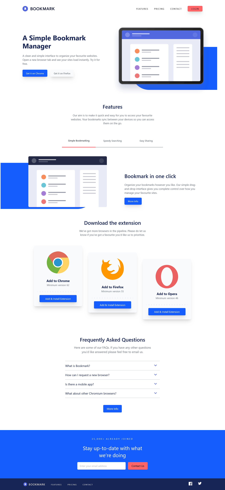

# Frontend Mentor - Bookmark landing page solution

This is a solution to the [Bookmark landing page challenge on Frontend Mentor](https://www.frontendmentor.io/challenges/bookmark-landing-page-5d0b588a9edda32581d29158). Frontend Mentor challenges help you improve your coding skills by building realistic projects.

## Table of contents

- [Overview](#overview)
- [The challenge](#the-challenge)
- [Screenshot](#screenshot)
- [Links](#links)
- [Built with](#built-with)
- [Author](#author)

## Overview

This project is a Bookmark Site landing page, made with HTML for the structure, CSS framework Tailwind CSS for the style and JavaScript for the interactive elements. The project is responsive for different devices sizes, the features section is interactive with different slides, same with the login email section, all interactive links and buttons have the active states when the mouse is on.

### The challenge

Users should be able to:

- View the optimal layout for the site depending on their device's screen size
- See hover states for all interactive elements on the page
- Receive an error message when the newsletter form is submitted if:
- The input field is empty
- The email address is not formatted correctly

### Screenshot

### Links

- Solution URL: [Solution URL]()
- Live Site URL: [Live Site URL](https://bookmark-landing-page-master-six.vercel.app/)

### Built with

- Semantic HTML5 markup
- Flexbox
- JavaScript
- Tailwind CSS framework

## Author

- Frontend Mentor - [@maria202costa](https://www.frontendmentor.io/profile/maria202costa)
